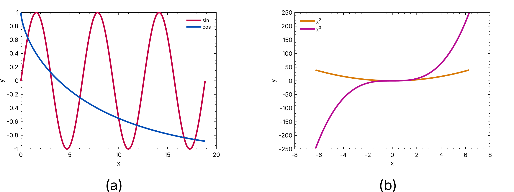

# svgsubfig


A python package for swift arrangement of raster images and vector graphics into a single figure based on SVG.

This package is focussed on the preparation of high quality figures that consist of several subimages, both vector and raster graphics, for publication in scientific journals. A label is inserted below each subimage, e.g. ``(a)``, ``(b)``, ...

Font family, size and gaps can be adjusted based on a JSON configuration. An example figure created with ``svgsubfig`` could look like this:



## Basic usage

### Installation

``svgsubfig`` can be installed using pip:

```console
pip install svgsubfig
```

### Configuration

Create a JSON configuration file with the following structure, use relative filenames for the individual (sub-)images (the directory of the config file acts as base directory).

```json
{
    "gap-between": 5,
    "gap-label": 3,
    "width": 150,
    "font-size": 9,
    "font-family": "Arial, Helvetica, sans-serif",
    "images": [
        "img/dog.jpeg",
        "img/population.svg"
    ],
    "description": [
        "A dog.",
        "The dogs population."
    ]
}
```

Following keys are available for the config file:

- ``description``: Text to be added after each label.
- ``font-family``: Typeface used in the SVG file for text.
- ``font-size``: Size of the labeling of the images in **pt**.
- ``gab-between``: Spacing between the subimages in **mm**.
- ``gap-label``: Spacing between labels and lower boundary of the images in **mm**.
- ``images``: Array of file paths of the images to include into the figure.
- ``index-offset``: Offset of the first subimage index, e.g. if ``index-offset = 3``, the first label will be ``(d)``
- ``width``: Width of the figure in **mm**.

To use automatic conversion of the created SVG figure file into PDF and PNG file formats, [Inkscape](https://inkscape.org/) needs to be installed and accessible on PATH.

### Figure composition

To create the final figure using the JSON configuration, a small ``svgsubfig`` command line utility can be used, but also scripting is possible.

#### Command line utility

To use the ``svgsubfig`` module to create the final figure file, use following command in your terminal:

```console
python -m svgsubfig [--noconvert] CONFIG_PATH
```

Replace ``CONFIG_PATH`` with the path of the JSON config file. Option ``--noconvert`` prevents conversion of the created SVG into PDF and PNG with Inkscape, which is useful in case Inkscape is not installed, or manual edits on the created SVG file are necessary.

#### Script

```python
import svgsubfig.utility as util

from svgsubfig import SVGSubFigure
from pathlib import Path

pth_config = Path("figure.json")
pth_svg = pth_config.with_suffix(".svg")

fig = SVGSubFigure.from_json(pth_config)
fig.save(pth_svg)

util.convert_svg(pth_svg)
```
